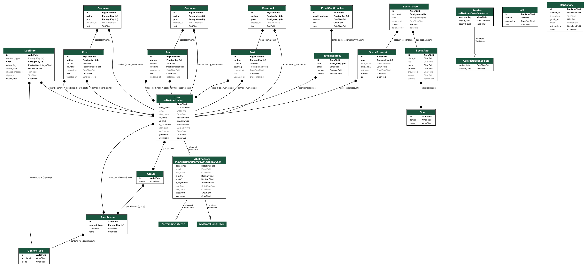
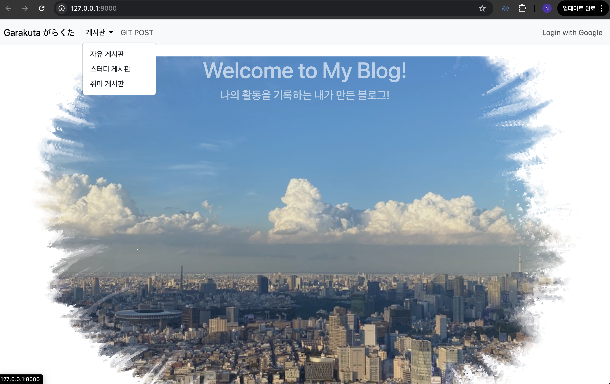

# myblog_project

## 제작 목적
- Django와 ChatGPT를 활용하여 개인 블로그를 제작
- 취미, 학습 내용, 프로젝트를 게시하고 소통하는 공간 마련

<br>

<hr>

<br>

## 목표
### 1차 목표
- Django 설치 및 설정, URL 구성, DB 연동
- 네비게이션 바 구성 (로그인, 게시판)

### 2차 목표
- 자유게시판 제작, Google OAuth 로그인 지원
- 로그인 없이도 접속 가능, 댓글/좋아요/포스팅 기능은 로그인 필요

### 3차 목표
- GitHub 프로젝트 등록 및 꾸미기
- 프로젝트 별 생성일 정렬 및 스타일링

### 4차 목표
- 스터디 및 취미 게시판 제작 및 드롭다운 메뉴 구성

### 5차 목표
- ERD 작성
- 도메인 설정 및 배포(AWS EC2, Django 배포 가이드 테스트 예정)

<br>

<strong>※ 진행 중 수정 가능 ※</strong>

<br>

<hr>

<br>

## 프로젝트 개요 (Project Overview)
"myblog_project"는 Django 기반으로 구축된 블로그 프로젝트입니다. Google OAuth로 로그인 기능 제공, 게시판 구성 등 사용자들이 다양한 주제의 글을 공유할 수 있도록 제작되었습니다.

<br>

## 기술 스택 (Tech Stack)
- **Backend:** 
- **Frontend:** , ,  ( 활용)
- **Database:**  (개발 환경),  (배포 환경 예정)
- **Authentication:** Google OAuth (django-allauth)
- **Deployment:** GitHub Pages,  (예정)
- **Version Control:** , 

<br>

## 디렉토리 구조 (Directory Structure)
```
myblog_project/
│
├── blog/              # 메인 블로그 앱
│   ├── migrations/    # 마이그레이션 파일
│   ├── templates/     # 템플릿 파일
│   └── ...
├── board/             # 자유 게시판 앱
├── study/             # 스터디 게시판 앱
├── hobby/             # 취미 게시판 앱
├── config/            # 프로젝트 설정
│   ├── settings.py    # Django 설정 파일
│   └── urls.py        # URL 라우팅 설정
└── manage.py          # Django 관리 명령어
```

<br>

## ERD (Entity Relationship Diagram)


<br>

<strong>※ 진행 중 수정 가능 ※</strong>

<br>

<hr>

<br>

## 진행 상황
- [main notion](https://www.notion.so/BLOG-Project-b8c76881fb9d4cc7928ad01c345e0f41?pvs=4)

- [1차 목표](https://www.notion.so/1-d1325722d2c4496a8cfe7fddd8798ee0?pvs=4)

- [2차 목표](https://www.notion.so/2-70a33021608b4690b099b1aa945f4464?pvs=4)

- [3차 목표](https://www.notion.so/3-8c9d610edd17439cae4d8266d632488c?pvs=4)

- [4차 목표](https://www.notion.so/4-547b31de74bd4f38ad37e9dc57583ac4?pvs=4)

- [5차 목표](https://www.notion.so/5-1108999765e280daa708c6f0bb61ce37?pvs=4)
  
- [AWS EC2 배포 가이드](https://www.notion.so/AWS-EC2-1128999765e280cd965bd5562284e468?pvs=4)
  
- [Django 배포 가이드](https://www.notion.so/Django-1128999765e28036a2a5dfee2c64c824?pvs=4)


## 결과
- 도메인을 무료로 구할 수 있는 방법이 있지만 안정적이지 않아서 추후 도메인 구매 후 더욱 업그레이드 할 예정

- 로컬에서 실행한 제작 페이지 모습
- main page
  

<br>

- Posts
  

<br>

- Study
  

<br>

- Hobby
  

<br>

- GitHub Posts
  

<br>